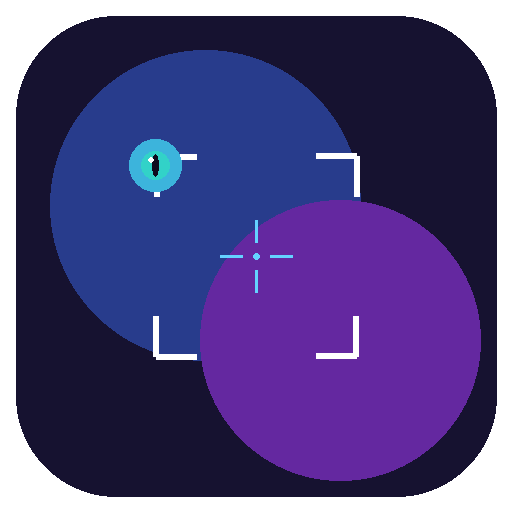

# PixelGrab

<p align="center">
  
</p>

<p align="center">
  <strong>跨平台屏幕截图、录屏与标注 C 库</strong><br>
  截图 · 标注 · 贴图 · 取色 · 录屏 · 一步到位
</p>

<p align="center">
  <a href="https://github.com/Yangqihu0328/loong-pixelgrab/releases/latest">
    
  </a>
  <a href="LICENSE">
    
  </a>
</p>

---

## 简介

**loong-pixelgrab** 是一个跨平台（Windows / macOS / Linux）屏幕截图与录屏 C 库，提供纯 C API（`extern "C"`），可轻松集成到任何语言的项目中。

库本身（`pixelgrab`）负责底层能力：截图、标注、贴图、取色、录屏、水印等。`examples/` 目录中包含一个完整的桌面应用（PixelGrab），演示了如何基于该库构建成熟的截图工具。

## 功能特性

| 模块 | 功能 |
|------|------|
| **屏幕截图** | 全屏、区域、窗口截图；多显示器 + HiDPI 支持；智能窗口吸附；截图历史 |
| **屏幕录制** | 区域录屏（H.264）；可配置帧率/码率；麦克风 + 系统音频；暂停/恢复；GPU 加速 |
| **标注引擎** | 矩形、椭圆、线条、箭头、铅笔、文字、马赛克、高斯模糊；撤销/重做 |
| **贴图（Pin）** | 将截图/文字/剪贴板固定为浮动置顶窗口；支持透明度、缩放、多窗口管理 |
| **颜色拾取** | 屏幕取色 + 放大镜；RGB / HSV / HEX 互转 |
| **水印** | 文字水印（自定义字体/大小/位置/旋转）；图片水印叠加 |

## 项目结构

```
loong-pixelgrab/
├── include/pixelgrab/       # 公共 C API 头文件
│   ├── pixelgrab.h          # 全部 API 声明（76 个函数）
│   └── version.h.in         # 版本号模板（CMake 自动生成）
├── src/                     # 库源码
│   ├── core/                # 核心逻辑（上下文、图像、日志、历史）
│   ├── annotation/          # 标注引擎
│   ├── detection/           # UI 元素检测与智能吸附
│   ├── pin/                 # 贴图窗口管理
│   ├── watermark/           # 水印渲染
│   └── platform/            # 平台实现
│       ├── windows/         #   Windows（Win32 + D3D11 + Media Foundation）
│       ├── macos/           #   macOS（CoreGraphics + ScreenCaptureKit）
│       └── linux/           #   Linux（X11 + Cairo + Pango）
├── examples/                # 示例应用（PixelGrab 桌面工具）
├── tests/                   # 单元测试（Google Test）
├── docs/                    # 文档
│   ├── BUILD.md             # 详细构建指南
│   └── RELEASE.md           # 发布流程
├── scripts/                 # 构建与发布脚本
├── CMakeLists.txt           # 根 CMake 配置
├── LICENSE                  # MIT 许可证
└── CHANGELOG.md             # 版本变更记录
```

## 快速开始

### 环境要求

- **CMake** >= 3.16
- **C++17** 编译器（MSVC 2019+、GCC 8+、Clang 8+）
- **Git**（用于 FetchContent 拉取依赖）

所有第三方依赖（[spdlog](https://github.com/gabime/spdlog)、[Google Test](https://github.com/google/googletest)）通过 CMake FetchContent 自动下载，无需手动安装。

### 编译

```bash
git clone https://github.com/Yangqihu0328/loong-pixelgrab.git
cd loong-pixelgrab

# 生成构建文件
cmake -B build -DCMAKE_BUILD_TYPE=Release

# 编译
cmake --build build --config Release
```

> 详细的平台编译指南（Windows / macOS / Linux）请参阅 [docs/BUILD.md](docs/BUILD.md)。

### CMake 选项

| 选项 | 默认值 | 描述 |
|------|--------|------|
| `PIXELGRAB_BUILD_EXAMPLES` | `ON` | 编译示例程序 |
| `PIXELGRAB_BUILD_TESTS` | `OFF` | 编译单元测试 |

### 在你的项目中使用

**方式一：CMake FetchContent**

```cmake
include(FetchContent)
FetchContent_Declare(
  pixelgrab
  GIT_REPOSITORY https://github.com/Yangqihu0328/loong-pixelgrab.git
  GIT_TAG        main
  GIT_SHALLOW    TRUE
)
set(PIXELGRAB_BUILD_EXAMPLES OFF CACHE BOOL "" FORCE)
set(PIXELGRAB_BUILD_TESTS OFF CACHE BOOL "" FORCE)
FetchContent_MakeAvailable(pixelgrab)

target_link_libraries(my_app PRIVATE pixelgrab)
```

**方式二：CMake add_subdirectory**

```cmake
add_subdirectory(third_party/loong-pixelgrab)
target_link_libraries(my_app PRIVATE pixelgrab)
```

### API 快速示例

```c
#include "pixelgrab/pixelgrab.h"

int main() {
    // 创建上下文
    PixelGrabContext* ctx = pixelgrab_context_create();

    // 截取主屏幕
    PixelGrabImage* img = pixelgrab_capture_screen(ctx, 0);

    // 获取像素数据
    int w = pixelgrab_image_get_width(img);
    int h = pixelgrab_image_get_height(img);
    const uint8_t* data = pixelgrab_image_get_data(img);

    // ... 使用像素数据 ...

    // 释放资源
    pixelgrab_image_destroy(img);
    pixelgrab_context_destroy(ctx);
    return 0;
}
```

## PixelGrab 桌面应用

`examples/` 目录包含基于 loong-pixelgrab 库构建的完整桌面应用：

### 快捷键

| 快捷键 | 功能 |
|:------:|------|
| **F1** | 截图（自动识别窗口 / 手动拖选区域） |
| **F3** | 将截图贴到屏幕 |
| **Esc** | 取消当前操作 |

### 下载安装

前往 [Releases](https://github.com/Yangqihu0328/loong-pixelgrab/releases) 页面下载最新安装包。

**系统要求：** Windows 10 / 11（64 位）。macOS、Linux 版本开发中。

## 贡献

欢迎提交 Issue 和 Pull Request！

1. Fork 本仓库
2. 创建你的 feature 分支：`git checkout -b feature/my-feature`
3. 提交你的修改：`git commit -m "feat: add my feature"`
4. 推送到远程：`git push origin feature/my-feature`
5. 创建 Pull Request

## 捐赠与联系

如果 PixelGrab 对你有帮助，欢迎请作者喝杯咖啡或通过微信交流！

| 个人微信 | 微信收款码 | 支付宝收款码 |
|:--------:|:----------:|:------------:|
|  |  |  |
| 扫码添加好友 | 微信赞赏 | 支付宝赞赏 |

> 感谢每一位支持者，你的鼓励是项目持续更新的动力！

## 许可证

[MIT License](LICENSE) - 详见 LICENSE 文件。
